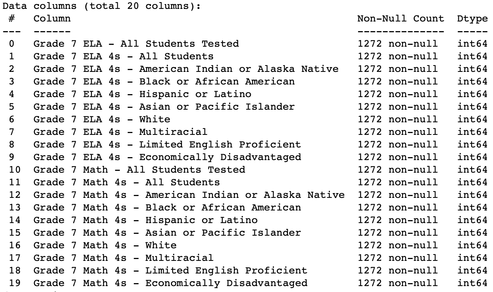

# Specialized High School Scholastic Aptitude Test Admission Performance #
Capstone Two: Predictors of test performance for specialized high school admissions offers.

## Background ##

Performance on the Specialized High School Admissions Test (SHSAT) determines eligibility to one of the eight specialized high schools in New York City. It is administered by the New York City Department of Education (DOE) to about a third of the city’s 8th graders, with **5,000** receiving admissions offers. Of major concern is the racial & ethnic breakdown of admitted students, showing significant underrepresentation from black and latinx students.

## Data ##

Two main data sets will be used:

_2016 School Explorer_

- This dataset consists of 1272 schools in New York city, and 161 variables, provided via kaggle. Primarily, it’s school descriptors, e.g. grades, race & ethnicity student percentages, high/low performing percentages of students. Data is available as a single csv file.
  - [Kaggle Dataset](https://storage.googleapis.com/kagglesdsdata/datasets%2F33225%2F44131%2F2016%20School%20Explorer.csv?GoogleAccessId=gcp-kaggle-com@kaggle-161607.iam.gserviceaccount.com&Expires=1595273466&Signature=fk6%2BI64ZSKXeenOP24Hsst9gNp2z3gFDGnz1rSXzcrnS874EFfR1VjUPVu0mCoN0bwXxJ7udjKpGlD51QLqiolRTpt9t%2F6ko672nNzd2KU0zJd4xRN8yW4Ouk1XxbCCTN2u6In241T1%2BY1RMpSp5rQgko83zQtwPClQPsl%2BWynlztsHV1aWF2K1J6MUy1SBaXyHvTSXBiMp1G2FvCoVjRVyjkXwV94Xgayi8Zgs3ISjyVUZn3yYzuyarl8NUwSnryWnfCE1debgt5z9AP5aTv7IbUA297hpYAhHZR0NjtKMwoadxypbWbBZ6cUTgI8KT4L4q8LdCgJ6SDJolkJERaQ%3D%3D) (API)

_2017-2018 SHSAT Admissions Test Offers By Sending School_

- This dataset consists of the 2017 SHSAT results, published by NYC in 2018. All test takers are north of 28,000, grade 8 students, Test takers and offers received are grouped by school. Data is available as a single csv file from the NYC Open Data portal.
  - [NYC Dataset](https://data.cityofnewyork.us/resource/vsgi-eeb5.csv) (CSV)

## Approach/Method ##

The goal of this analysis is to elicit which factors predict performance on the SHSAT. These factors will serve as beacons to direct or draw services, whether education-based or otherwise, towards improving the percentage of black and latinx students admitted to the specialized high schools.

This approach aims to quantify which variables lead to admissions offers _beyond_ prior proxies: English Language Learners, Students with Disabilities, Students on Free/Reduced Lunch, and Students with Temporary Housing.

Initially we can assume that those students who perform well on typical standardized tests, throughout the school year, would therefore perform well on the SHSAT. We'll investigate this and extrapolate as to whether this is the case across all schools/students that follow this assumption.

As a bit of forecasting, I'll use linear regression models to determine how many admissions offers schools that fit a certain testing/aptitude standard could be getting based on their current testing scores.

## Feature Engineering & Data Cleaning ##

To determine what factors are related to receiving admissino offers to the specialized high schools, the data feeding into the models need to be not only numeric but free of errors. 
 
We can see that the _2016 School Explorer_ data set has three columns almost entirely of null values. These can be filled with an appropriate value for the data type of those columns.
 
|  | Percent |
| :- | :- |
| Other Location Code in LCGMS | 0.999214 |
| Adjusted Grade | 0.998428 |
| New? | 0.978774 |
| School Income Estimate | 0.311321 |
 
Given the test-takers in the _2017-2018 SHSAT Admissions Test Offers By Sending School_ are a year away from taking the test in _2016 School Explorer_ dataset, I'll focus on the 7th graders.

_2016 School Explorer_ has 20 variables with information 7th graders. This data is broken up into two kinds of information, ELA (English Language Arts) & Math. Scoring on these tests top out at 4, with 1 representing the worst score.
 

 
Therefore, the best students are in the '4s' columns shown above.

Summary of columns:

- All students tested
- All students with 4 scores
- American Indian or Alaska Native with 4 scores
- Black or African American students with 4 scores
- Hispanic or Latino students with 4 scores
- Asian or Pacific Islander students with 4 scores
- White students with 4 scores
- Multiracial students with 4 scores
- Limited English Proficient students with 4 scores
- Economically Disadvantaged with 4 scores

## Project Organization ##
------------

    ├── LICENSE
    ├── Makefile           <- Makefile with commands like `make data` or `make train`
    ├── README.md          <- The top-level README for developers using this project.
    ├── data
    │   ├── external       <- Data from third party sources.
    │   ├── interim        <- Intermediate data that has been transformed.
    │   ├── processed      <- The final, canonical data sets for modeling.
    │   └── raw            <- The original, immutable data dump.
    │
    ├── docs               <- A default Sphinx project; see sphinx-doc.org for details
    │
    ├── models             <- Trained and serialized models, model predictions, or model summaries
    │
    ├── notebooks          <- Jupyter notebooks. Naming convention is a number (for ordering),
    │                         the creator's initials, and a short `-` delimited description, e.g.
    │                         `1.0-jqp-initial-data-exploration`.
    │
    ├── references         <- Data dictionaries, manuals, and all other explanatory materials.
    │
    ├── reports            <- Generated analysis as HTML, PDF, LaTeX, etc.
    │   └── figures        <- Generated graphics and figures to be used in reporting
    │
    ├── requirements.txt   <- The requirements file for reproducing the analysis environment, e.g.
    │                         generated with `pip freeze > requirements.txt`
    │
    ├── setup.py           <- makes project pip installable (pip install -e .) so src can be imported
    ├── src                <- Source code for use in this project.
    │   ├── __init__.py    <- Makes src a Python module
    │   │
    │   ├── data           <- Scripts to download or generate data
    │   │   └── make_dataset.py
    │   │
    │   ├── features       <- Scripts to turn raw data into features for modeling
    │   │   └── build_features.py
    │   │
    │   ├── models         <- Scripts to train models and then use trained models to make
    │   │   │                 predictions
    │   │   ├── predict_model.py
    │   │   └── train_model.py
    │   │
    │   └── visualization  <- Scripts to create exploratory and results oriented visualizations
    │       └── visualize.py
    │
    └── tox.ini            <- tox file with settings for running tox; see tox.readthedocs.io

--------

<small>Project structure based on the <a target="_blank" href="https://drivendata.github.io/cookiecutter-data-science/">cookiecutter data science project template</a>. #cookiecutterdatascience</small>

