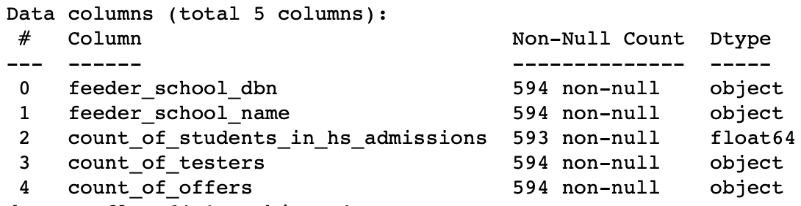

# Specialized High School Scholastic Aptitude Test Admission Performance #
Capstone Two: Predictors of test performance for specialized high school admissions offers.

## Background ##

Performance on the Specialized High School Admissions Test (SHSAT) determines eligibility to one of the eight specialized high schools in New York City. It is administered by the New York City Department of Education (DOE) to about a third of the city’s 8th graders, with **5,000** receiving admissions offers. Of major concern is the racial & ethnic breakdown of admitted students, showing significant underrepresentation from black and latinx students.

## Data ##

Two main data sets will be used:

_2016 School Explorer_ (Explorer)

- This dataset consists of 1272 schools in New York city, and 161 variables, provided via kaggle. Primarily, it’s school descriptors, e.g. grades, race & ethnicity student percentages, high/low performing percentages of students. Data is available as a single csv file.
  - [Kaggle Dataset](https://storage.googleapis.com/kagglesdsdata/datasets%2F33225%2F44131%2F2016%20School%20Explorer.csv?GoogleAccessId=gcp-kaggle-com@kaggle-161607.iam.gserviceaccount.com&Expires=1595273466&Signature=fk6%2BI64ZSKXeenOP24Hsst9gNp2z3gFDGnz1rSXzcrnS874EFfR1VjUPVu0mCoN0bwXxJ7udjKpGlD51QLqiolRTpt9t%2F6ko672nNzd2KU0zJd4xRN8yW4Ouk1XxbCCTN2u6In241T1%2BY1RMpSp5rQgko83zQtwPClQPsl%2BWynlztsHV1aWF2K1J6MUy1SBaXyHvTSXBiMp1G2FvCoVjRVyjkXwV94Xgayi8Zgs3ISjyVUZn3yYzuyarl8NUwSnryWnfCE1debgt5z9AP5aTv7IbUA297hpYAhHZR0NjtKMwoadxypbWbBZ6cUTgI8KT4L4q8LdCgJ6SDJolkJERaQ%3D%3D) (API)

_2017-2018 SHSAT Admissions Test Offers By Sending School_ (Offers)

- This dataset consists of the 2017 SHSAT results, published by NYC in 2018. All test takers are north of 28,000, grade 8 students, Test takers and offers received are grouped by school. Data is available as a single csv file from the NYC Open Data portal.
  - [NYC Dataset](https://data.cityofnewyork.us/resource/vsgi-eeb5.csv) (CSV)

## Approach/Method ##

The goal of this analysis is to elicit which factors predict performance on the SHSAT. These factors will serve as beacons to direct or draw services, whether education-based or otherwise, towards improving the percentage of black and latinx students admitted to the specialized high schools.

This approach aims to quantify which variables lead to admissions offers _beyond_ prior proxies: English Language Learners, Students with Disabilities, Students on Free/Reduced Lunch, and Students with Temporary Housing.

Initially we can assume that those students who perform well on typical standardized tests, throughout the school year, would therefore perform well on the SHSAT. We'll investigate this and extrapolate as to whether this is the case across all schools/students that follow this assumption.

As a bit of forecasting, I'll use linear regression models to determine how many admissions offers schools that fit a certain testing/aptitude standard could be getting based on their current testing scores.

## Data Cleaning  ##

To determine what factors are related to receiving admissino offers to the specialized high schools, the data feeding into the models need to be not only numeric but free of errors. 
 
We can see that the _2016 School Explorer_ data set has three columns almost entirely of null values. These can be filled with an appropriate value for the data type of those columns.
 
|  | Percent |
| :- | :- |
| Other Location Code in LCGMS | 0.999214 |
| Adjusted Grade | 0.998428 |
| New? | 0.978774 |
| School Income Estimate | 0.311321 |
 
Given the test-takers in the _2017-2018 SHSAT Admissions Test Offers By Sending School_ are a year away from taking the test in _2016 School Explorer_ dataset, I'll focus on the 7th graders.

_2016 School Explorer_ has 20 variables with information 7th graders. This data is broken up into two kinds of information, ELA (English Language Arts) & Math. Scoring on these tests top out at 4, with 1 representing the worst score.
 
|  |
| :-: |
 
Therefore, the best students are in the '4s' columns shown above.

Summary of columns:

- All students tested
- All students with 4 scores
- American Indian or Alaska Native with 4 scores
- Black or African American students with 4 scores
- Hispanic or Latino students with 4 scores
- Asian or Pacific Islander students with 4 scores
- White students with 4 scores
- Multiracial students with 4 scores
- Limited English Proficient students with 4 scores
- Economically Disadvantaged with 4 scores

In 2016, the total number of 7th graders in NYC Middle Schools was **69,053**. Of those, **8,320** had ELA scores of 4, and **10,888** had Math scores of 4.

|  |
| :-: |

**537** NYC Middle Schools sent at least 6 students to SHSAT for a total of **25,349** 8th graders taking the test. **57** schools send 0-5 8th graders to take the test. **121** NYC Middle Schools saw _at least_ 6 of their students receive offers, for a total of **4,018** 8th graders having received an offer. **473** schools saw 0-5 of their 8th graders receive an offer.

**Merging Datasets**

Using the DBN & Location Code I'll merge _Explorer_ data for 7th graders to the _Offers_ information for SHSAT testers. In the process it looks like **2** schools in _Explorer_ didn't have information in the _Offers_ dataset.

## Exploratory Data Analysis & Feature Engineering ##

Looking at the assumption that those students/schools that have the majority of the 4 scores will, in turn, perform well on the aptitude test for the specialized high school, we can see that Black & Latinx students may receive less admittance offers based on this limited criteria.

|  |
| :-: |

In order to better summarize the schools/students into ranges of test scores, I've added the following features:

- “Percentage of SHSAT takers receiving an offer” (Numbers of SHSAT takers / Number of Offers by school)
- “The total number of Black/Hispanic students in Grade 8” (Number of 8th graders * Percent Black / Hispanic)
- “Percentage of students who did the SHSAT” (Number of SHSAT takers / Number of 8th graders)
- “Average Mark” (the average of Average ELA Proficiency and Average Math Proficiency)
- “Percent of students with Level 4 ELA in Grade 7 (Grade 7 ELA 4s - All Students / Grade 7 ELA - All Students Tested)
- “Percent of students with Level 4 Math in Grade 7 (Grade 7 Math 4s - All Students / Grade 7 Math - All Students Tested)
- “Percent of students with Level 4 in Grade 7” (average of 4 percentages ELA and Math in Grade 7)
- “Average number of Level 4 students” (Grade 7 ELA 4s - All Students + Grade 7 Math 4s - All Students)/2

**Schools with the highest number of test takers**

What we're seeing in this next plot is that those schools that send the most 8th graders to the SHSAT, have less of their school, percentage-wise, represented by Black or Latinx students.

Interestingly, there is a high percentage of Black/Hispanic students (The William W. Niles (**82%**) school , and The Eugenio Maria De Hostos (**78%**) school ), near the middle of the pack and the lowest, respectively.

|  |
| :-: |

**Schools with the least number of test takers**

_Nearly_ all of the schools with the least number of test takers in 2017 (55) had low average marks (average of AvgELA and AvgMath).

Also, most schools had a high percentage of Black or Hispanic students.

|  |
| :-: |

**Number of offers by school**

The top 25 schools with the most offers received had lower percentages of Black or Hispanic students (highest percentage is at Frank Sansivieri school with **59%** Black or Hispanic students).

|  |
| :-: |

**Highest percentage of offers for the number of test takers**

Below are the top 20 schools that had the highest percentage of offers for the number of test takers, representing how successful that school was as to the number of students that were admitted to the specialized high school.

The Christa McAuliffe School had the msot success with **82%** of 251 students taking the test getting an offer.

The schools scoring best at the percentage of students actually getting an offer are very low in Black or Latinx student percentages (the exception is the small Columbia Secondary School with **64%** Black/Latinx).

|  |
| :-: |

**Least percentage of offers for the number of test takers**

Of those schools which had _at least_ 6 offers, the 20 schools with least success are shown below.

Two of the largest schools that are predominatly Black/Latinx and sent many students to the test are J.H.S 118 William W. Niles school @ **424** 8th graders (**82%** Black/Latinx) and I.S. 318 Eugenio Maria De Hostos @ **467** 8th graders (**78%** Black/Latinx).

|  |
| :-: |

## Models & Evaluation ##

My intent is to use regression-based models because my label/y is numeric in nature and the interest I have is in how many offers a school ought to expect given the features/independent variables one could supply to the model.

Initially I will determine which regressor algorithm performs best then I will use an ensemble meta-estimator that fits several base regressors, each on the whole dataset then averages the individual predictions to form a final prediction.

Each of the Regressors is used to used to make the first **25** predictions.

|  |
| :-: |

- Gradient Boosting Regressor R2: 0.930 
- Random Forest Regressor R2: 0.946 
- Linear Regression R2: 0.930 
- Voting Regressor R2: 0.966

Given the R2 scores are so close, I'll lean towards simplicity rather than running several base regressors and an ensemble to gain just a **3%** gain in explained behavior/R2 by choosing to do a **linear regression** going forward.

|  |
| :-: |

## Predictions ##

There's a strong correlation between the percent of test takers in a school and the number of offers that that high school received.

One approach to achieving more admissions offers is to send more students to take the SHSAT, based on the average number of level 4 scorers in the school.

|  |
| :-: |

The model is based on 530 schools (536 schools with at least 6 SHSAT takers, as SHSAT is unknown for category 0-5 takers. For 6 out of those 536 schools the AvgMark is 0 as a result.

**Top 25 schools that can send more students to the take the test**

Below, are the predictions by school regarding the percent of students that could have taken the SHSAT (PerModelDidSHSAT). The PotentialTakers takes the difference between the PerModelDidSHSAT and PerDidSHSAT (ModAgainstDidSHSAT) multiplied by the total number of 8th grade students in each school (count\_of_students_hs_admissions).

- The above-referenced schools ought to send more students to take the SHSAT as their average marks may translate into more of their students receiving offers to attend the specialized high schools.
- Increasing the number of test-takers from schools with higher percentages of Black &/or Latinx test-takers will help address the deep disparity of offers being received by White and Asian students.

Another approach is to only send test takers that're high performing students, or those who are level 4.

All possible performance related predictors (mark and level4) are very strongly correlated with each other (multicolinear). Another way to look at what can predict (successful) performance on the SHSAT is to look at percent of offers by student (PctOffersByStudent) that took the SHSAT to the percent of level-4 students in 7th grade (PctScore4).

**Top 25 schools that can increase the percent of their students receiving offers**

Here I'm making predictions by school regarding the percent of offers per student according to the model (mod_offers). Real offers (RealOffers) looks at the modeled percent offers (PctModelOffers) multiplied by the number of SHSAT takers. PotentialOffers takes the difference of RealOffers from actual offers (NumSpecializedOffers).

The above table is filtered to exclude schools in eight overperforming districts, detailed below. "Overperforming" means total offers (NumSpecializedOffers) divided by total 8th graders (count_of_students_in_hs_admissions).

The table displays schools that should have received at least 10 Extra Offers according to the model in under and average performing districts (listed below).

In particular, **P.S. 235 Janice Marie Knight School** & **J.H.S. 118 William W. Niles** are great candidates that should've seen their students receive more **21** and **11** more offers, respectively, for admission to the specialized high schools. Their high percentage of Black &/or Latinx students would've improved the rate at which those ethnicities receive offers across NYC.

## Project Organization ##
------------

    ├── LICENSE
    ├── Makefile           <- Makefile with commands like `make data` or `make train`
    ├── README.md          <- The top-level README for developers using this project.
    ├── data
    │   ├── external       <- Data from third party sources.
    │   ├── interim        <- Intermediate data that has been transformed.
    │   ├── processed      <- The final, canonical data sets for modeling.
    │   └── raw            <- The original, immutable data dump.
    │
    ├── docs               <- A default Sphinx project; see sphinx-doc.org for details
    │
    ├── models             <- Trained and serialized models, model predictions, or model summaries
    │
    ├── notebooks          <- Jupyter notebooks. Naming convention is a number (for ordering),
    │                         the creator's initials, and a short `-` delimited description, e.g.
    │                         `1.0-jqp-initial-data-exploration`.
    │
    ├── references         <- Data dictionaries, manuals, and all other explanatory materials.
    │
    ├── reports            <- Generated analysis as HTML, PDF, LaTeX, etc.
    │   └── figures        <- Generated graphics and figures to be used in reporting
    │
    ├── requirements.txt   <- The requirements file for reproducing the analysis environment, e.g.
    │                         generated with `pip freeze > requirements.txt`
    │
    ├── setup.py           <- makes project pip installable (pip install -e .) so src can be imported
    ├── src                <- Source code for use in this project.
    │   ├── __init__.py    <- Makes src a Python module
    │   │
    │   ├── data           <- Scripts to download or generate data
    │   │   └── make_dataset.py
    │   │
    │   ├── features       <- Scripts to turn raw data into features for modeling
    │   │   └── build_features.py
    │   │
    │   ├── models         <- Scripts to train models and then use trained models to make
    │   │   │                 predictions
    │   │   ├── predict_model.py
    │   │   └── train_model.py
    │   │
    │   └── visualization  <- Scripts to create exploratory and results oriented visualizations
    │       └── visualize.py
    │
    └── tox.ini            <- tox file with settings for running tox; see tox.readthedocs.io

--------

<small>Project structure based on the <a target="_blank" href="https://drivendata.github.io/cookiecutter-data-science/">cookiecutter data science project template</a>. #cookiecutterdatascience</small>

